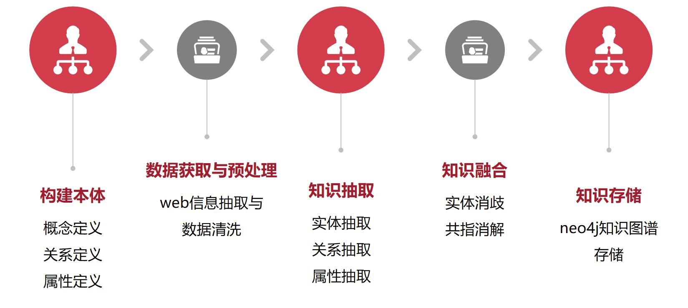

# AIOps-Knowledge-Graph-WebData
***
- 项目分为图谱构建与图谱应用两个模块
- 每个模块代码放在不同的文件夹中
***
## 图谱构建
- 图谱构建采用一下流程构建，具体代码与解释说明在文件中

## 知识介绍应用
### 运行与启动
#### 安装jdk
可参考：[https://blog.csdn.net/qq_42003566/article/details/82629570](https://blog.csdn.net/qq_42003566/article/details/82629570)
#### 安装Neo4j
可参考：[https://www.cnblogs.com/ljhdo/p/5521577.html](https://www.cnblogs.com/ljhdo/p/5521577.html),注意开放外网访问  0.0.0.0
#### IDEA 导入项目 
导入成功后对着项目根目录，右键->maven->reimport，等待其执行完成，倘若下载jar包太慢，自己配置外部maven仓库[https://blog.csdn.net/liu_shi_jun/article/details/78733633](https://blog.csdn.net/liu_shi_jun/article/details/78733633)
以上配置在linux下配置自行百度
#### 找到目录 src/main/resources  
修改application.yml,neo4配置url，password,改成自己的，同理修改mysql（mysql脚本在根目录下，knowledgegraph.sql）
#### 打包发布  
在idea 右侧 有 maven project 工具栏，点击展开lifecycle-clean,然后install,等待完成后在控制台可以看见打包的目录，例如：[INFO] Installing F:\git\Neo4j\kgmaker\target\kgmaker-0.0.1-SNAPSHOT.jar 复制jar包，去windows  或者linux下 切换到jar包目录执行  jar包   java -jar xxx.jar  即可启动，想部署到tomcat自行百度，springboot配置外部tomcat
#### 访问路径
启动后访问[http://localhost](http://localhost) 
